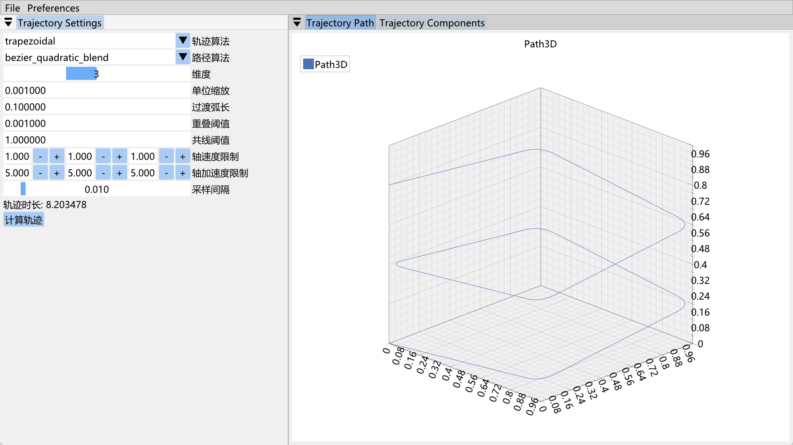
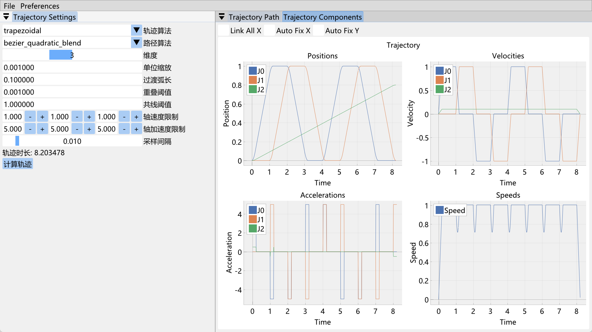

# TrajectoryArt 预编译库文件

本仓库定期发布预编译好的TrajectoryArt动态库文件，可以在[TrajectoryArt](./TrajectoryArt)中查看。


## 使用教程

详细内容查看 [TrajectoryArt 轨迹规划教程](https://blog.myshawn.com/blog/trajectoryart-%E8%BD%A8%E8%BF%B9%E8%A7%84%E5%88%92%E6%95%99%E7%A8%8B/)
或者请参考 [TrajectoryArt Notebook教程1](./Doc/Tutorial1.ipynb)

### 快速上手

#### 使用 TrajectoryArtWizard 交互式界面

克隆本仓库后，直接双击运行 `TrajectoryArt/bin/TrajectoryArtWizardApp.exe`，打开 `TrajectoryArt/Example/WaypointsJoint.txt` 文件，然后调整参数，最终生成的轨迹图如下：





如果想要将 TrajectoryArtWizard 集成到自己的软件中，使用如下代码：

```cpp
#include <TA/TrajectoryArtWizard.h>

int main() {
    // you will need to open the waypoint file from GUI
    TA::ShowTrajectoryArtWizard();

    // if you already have waypoints, then
    TA::ShowTrajectoryArtWizard(waypoints);

    // or if you already construct a trajectory
    TA::ShowTrajectoryArtWizard({}, traj);

    return 0;
}
```

!!! note
    路径点文件必须每行包括一个点的坐标，各个坐标值用空格分开，以 `#` 开头的行视为注释，不解析，比如：

    ```text
    # this is a comment
    0 0 0
    1000 0 100
    1000 1000 200
    0 1000 300
    0 0 400
    1000 0 500
    1000 1000 600
    0 1000 700
    0 0 800
    ```

#### 使用c++库
在c++中包含头文件，并链接了动态库文件，然后调用Trajectory类的Create方法即可。

```cpp
#include <TA/TrajectoryArt.h>

int main() {
    // 定义轨迹点
    std::vector<std::vector<double>> waypoints = {
        {   0.,    0.,    0.},
        {1000.,    0.,  100.},
        {1000., 1000.,  200.},
        {   0., 1000.,  300.},
        {   0.,    0.,  400.},
        {1000.,    0.,  500.},
        {1000., 1000.,  600.},
        {   0., 1000.,  700.},
        {   0.,    0.,  800.},
    };

    // 创建轨迹
    auto traj = Trajectory::Create(waypoints, {
        {"algorithm", "trapezoidal"},
        {"path_type", "bezier_quadratic_blend"},
        {"tolerance_blend", 100.0},
        {"vel_limits", std::vector<double>{500.0, 500.0, 500.0}},
        {"acc_limits", std::vector<double>{3000.0, 3000.0, 3000.0}},
    });

    std::vector<double> position, velocity, acceleration;
    double duration = traj->GetDuration();
    double dt = 0.01;
    for (double t =0; t < duration; t += dt) {
        position = traj->GetPosition(t);
        velocity = traj->GetVelocity(t);
        acceleration = traj->GetAcceleration(t);
    }
}
```
#### 使用python库

`python` 库支持 `python 3.12`，使用方法类似：

```python
import numpy as np
from PyTrajectoryArt import Trajectory

waypoints = np.array([[   0.,    0.,    0.],
                    [1000.,    0.,  100.],
                    [1000., 1000.,  200.],
                    [   0., 1000.,  300.],
                    [   0.,    0.,  400.],
                    [1000.,    0.,  500.],
                    [1000., 1000.,  600.],
                    [   0., 1000.,  700.],
                    [   0.,    0.,  800.]])

params = {}
params["algorithm"] = "trapezoidal" 
params["path_type"] = "bezier_quadratic_blend" 
params["tolerance_blend"] = 100.0 
params["vel_limits"] = [500.0] * 3
params["acc_limits"] = [3000.0] * 3

traj = Trajectory.Create(waypoints, params)
```

更详细文档请查看 [TrajectoryArt 轨迹规划教程](https://blog.myshawn.com/blog/trajectoryart-%E8%BD%A8%E8%BF%B9%E8%A7%84%E5%88%92%E6%95%99%E7%A8%8B/)。

## 更新日志

### v0.4.0

- 增加了 TrajectoryArtWizard 库，支持轨迹规划的交互式界面

### v0.3.0

- 实现toppra时间最优算法
- 支持梯形匀速算法
- 路径插值实现了圆弧、贝塞尔五阶过度算法
- 调整了调用接口，除 `waypoints` 外，其他参数都以关键字参数传入